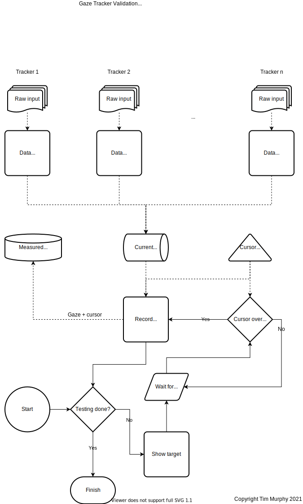
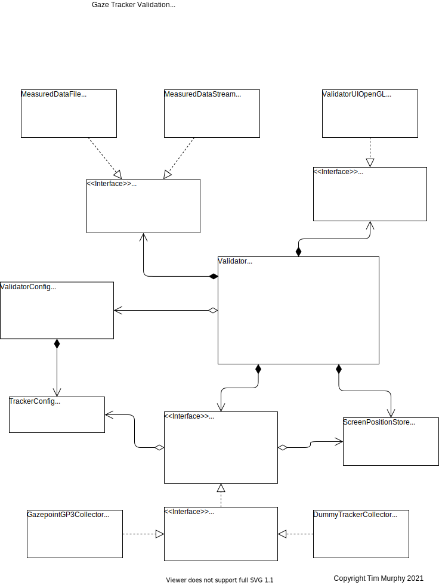

# Eye Tracker Validation
If you're looking for software to download, it can be found in the "Releases"
section on the right. Only a Windows binary is available pre-compiled at the
moment.

This software is a free, open-source tool which can be used to validate the
accuracy and precision of an eye tracker system. The tool works on Windows
and should also work on Linux and OS-X, though this hasn't been tested.
It has been designed to allow new trackers to be easily added and tested with
minimal coding; the demo programs included with your eye tracker will probably
contain all the code you need.

If you use this tool and add a new tracker, please submit a pull request to
allow others to make use of your work.

If you use this software for research, please cite the following paper:

https://link.springer.com/article/10.3758/s13428-022-02023-y

    @article{Murphy2022,
      author = {Murphy, Timothy I and Abel, Larry A and Armitage, James A and Douglass, Amanda G},
      doi = {10.3758/s13428-022-02023-y},
      issn = {1554-3528},
      journal = {Behavior Research Methods},
      title = {{Effects of tracker location on the accuracy and precision of the Gazepoint GP3 HD for spectacle wearers}},
      doi = {https://doi.org/10.3758/s13428-022-02023-y},
      url = {https://link.springer.com/article/10.3758/s13428-022-02023-y},
      year = {2022}
    }


## Dependencies
The number of dependencies has intentionally been kept small to allow the code
to be built and run with minimal fuss. The build is managed by `cmake`, with UI
components managed by `OpenGL`. Both of these are widely available.

### Windows
On Windows, the easiest way to get up and running is to open the folder with
Visual Studio. If you don't have `cmake` or a C++ compiler installed, they can
be added using the Visual Studio Installer. `OpenGL` is available in Windows by
default.

### Linux
On Linux, the only additional dependencies are the OpenGL and X11 development
libraries. To install on a debian-based system, use the following:

```sudo apt-get install -y libgl1-mesa-dev libglu1-mesa-dev libxi-dev```

If you don't have `cmake` or C/C++ compilers installed, you'll need these too:

```sudo apt-get install -y build-essential cmake```

## Build
Since this project uses `cmake`, your build tool can change depending on your
environment. The default settings are listed below.

### Windows
From Visual Studio, simply build the target `TrackerValidation`. This will
generate the build files (`ninja` by default) and run them. Nothing else to do.

### Linux
`cmake` will generate `Makefile` files by default. From the root directory, run
the following to generate the files:

```cmake .```

To compile, run:

```make```

Note that if you don't add/remove any source code, libraries or other
dependencies, then you only need to run `make` after each code change. If you
_do_ change dependencies, you'll need to run `cmake .` from the root directory
again.

# Design Overview

## Data and Process Flow


## Object Relations

